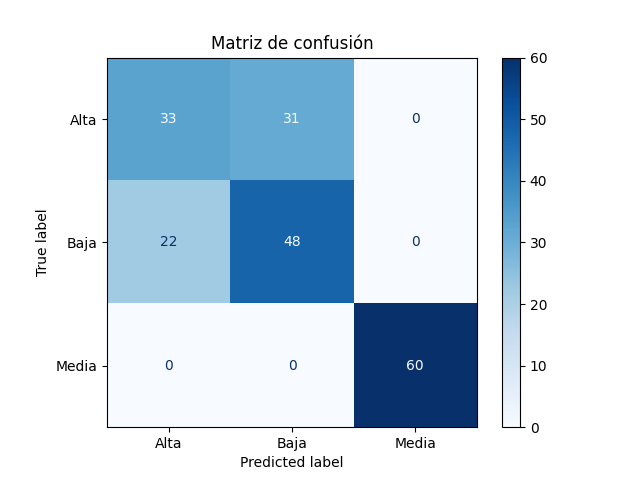
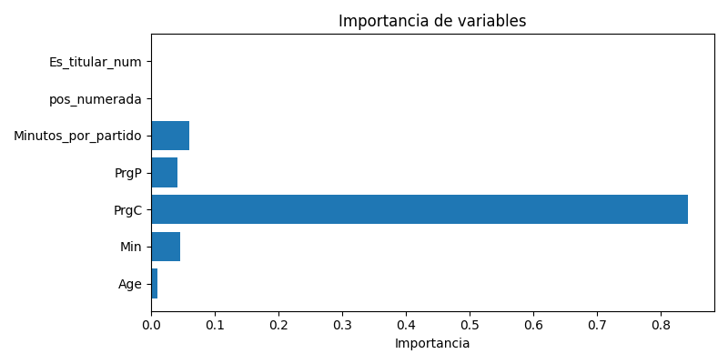

# Informe: Clasificación de Eficiencia de Jugadores de la Premier League

## 1. Descripción del dataset

- **Fuente:** https://www.kaggle.com/datasets/siddhrajthakor/fbref-premier-league-202425-player-stats-dataset — Estadísticas de jugadores de la Premier League 2024-25.
- **Número de registros:** Corresponde a los jugadores con al menos 270 minutos jugados (tras filtrado).
- **Variables:**  
  - `Age`, `Min`, `PrgC`, `PrgP`, `MP`, `Starts`, `Pos`, `Gls`, `G-PK`, `npxG`, `Ast`, `xAG`, entre otras.
- **Objetivo:**  
  Clasificar a los jugadores en tres categorías de eficiencia (`Alta`, `Media`, `Baja`) según su rendimiento ofensivo (goles y asistencias ajustados por expectativas).

## 2. Preprocesamiento realizado

- **Filtrado:** Solo jugadores con al menos 270 minutos jugados.
- **Variables derivadas:**  
  - `xG_safe` y `xAG_safe` para evitar divisiones por cero.
  - `Minutos_por_partido`, `Es_titular`, `pos_numerada`, `Es_titular_num`.
- **Variable objetivo:**  
  - `Eficiencia` (Alta, Media, Baja) calculada a partir de la relación entre goles/asistencias y sus expectativas.
- **Balanceo de clases:**  
  - Se utilizó `RandomOverSampler` para igualar la cantidad de ejemplos en cada clase antes de entrenar el modelo.

## 3. Evaluación de resultados

### a. Métricas de rendimiento

| Clase | Precisión | Recall | F1-score | Soporte |
|-------|-----------|--------|----------|---------|
| Alta  |   0.60    |  0.52  |   0.55   |   64    |
| Baja  |   0.61    |  0.69  |   0.64   |   70    |
| Media |   1.00    |  1.00  |   1.00   |   60    |

- **Accuracy:** 0.73
- **Macro avg:** 0.73
- **Weighted avg:** 0.72

### b. Visualizaciones

#### Matriz de confusión

#### Importancia de variables

## 4. Conclusiones

- El balanceo de clases permitió que el modelo reconociera adecuadamente las tres categorías de eficiencia.
- El árbol de decisión logró un desempeño aceptable, especialmente considerando la simplicidad del modelo y el balance de clases.
- La clase "Media" fue perfectamente reconocida, aunque esto puede indicar sobreajuste debido al balanceo artificial.
- Para mejorar, se recomienda probar modelos más complejos (Random Forest, XGBoost) y técnicas de validación cruzada.
- El aprendizaje principal fue la importancia del preprocesamiento y el balanceo de clases para evitar sesgos en los resultados.

---

> 