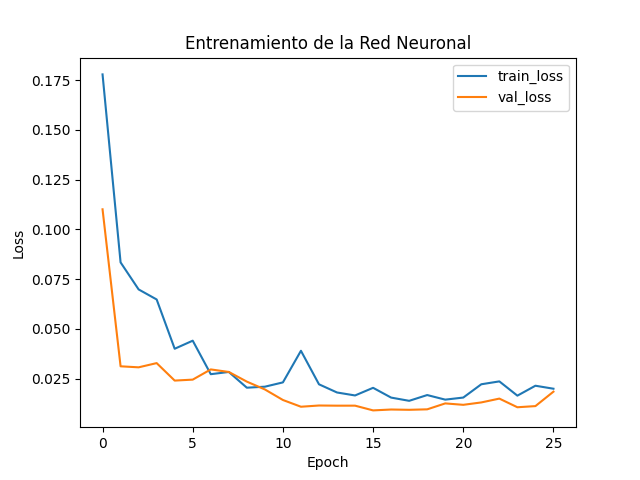

# Informe: Red Neuronal sobre Jugadores de la Premier League

## 1. Descripción del dataset
- **Fuente:** Kaggle (Premier League Player Stats)
- **Registros:** 574 jugadores
- **Variables:** 36 columnas (edad, nacionalidad, posición, minutos jugados, goles, asistencias, métricas avanzadas, etc.)
- **Objetivo del problema:** Predicción de la métrica avanzada `npxG+xAG.1` (expected goals sin penales + expected assists por 90 minutos), que mide el aporte ofensivo esperado de cada jugador.

## 2. Preprocesamiento realizado
- **a. Limpieza de datos faltantes:**
  - Se eliminaron filas con valores nulos para asegurar la calidad de los datos.
- **b. Codificación de variables categóricas:**
  - Se aplicó Label Encoding a columnas de tipo texto (por ejemplo, nombre, nacionalidad, posición, equipo).
- **c. Escalado/normalización:**
  - Se utilizó `StandardScaler` para normalizar todas las variables predictoras numéricas.
- **d. División en train/test:**
  - 80% de los datos para entrenamiento, 20% para prueba, usando `train_test_split`.

## 3. Entrenamiento del modelo
- **Modelo:** Red Neuronal (Keras Sequential)
- **Arquitectura:**
  - Capa densa (128 neuronas, ReLU) + Dropout 0.3
  - Capa densa (64 neuronas, ReLU) + Dropout 0.2
  - Capa densa (32 neuronas, ReLU)
  - Capa de salida (1 neurona, regresión)
- **Parámetros:**
  - Optimizer: Adam
  - Loss: MSE
  - Métrica: MAE
  - EarlyStopping con paciencia de 10 epochs
  - Epochs máximos: 100
  - Batch size: 32

## 4. Evaluación de resultados
- **Métricas de rendimiento:**
  - MSE (Error cuadrático medio) ≈ 0.01
  - R2 (Coeficiente de determinación) ≈ 0.89
- **Visualización:**
  - Se generó una gráfica de la evolución de la pérdida (loss) en entrenamiento y validación (`training_plot.png`).



## 5. Conclusiones
- La red neuronal logra predecir con alta precisión la métrica avanzada `npxG+xAG.1`, útil para analizar el aporte ofensivo esperado de los jugadores.
- El preprocesamiento fue clave para el buen desempeño del modelo.
- El modelo puede ser usado para scouting, análisis de rendimiento y predicción de potencial ofensivo en fútbol profesional.
- Como mejora futura, se podría comparar con otros modelos clásicos y probar técnicas de validación cruzada.

---

## Ejecución paso a paso

1. **Ubícate en la carpeta del proyecto:**
  - Abre una terminal y navega a la carpeta `Entrega_2/red_neuronal`.
  ```
  cd Entrega_2/red_neuronal
  ```

2. **Activa el entorno virtual (recomendado):**
  - Si tienes el entorno virtual en `Entrega_2/.venv`, actívalo con:
  ```
  ..\.venv\Scripts\activate
  ```
  - Si no tienes entorno virtual, puedes crearlo con:
  ```
  python -m venv ..\.venv
  ..\.venv\Scripts\activate
  ```

3. **Instala las dependencias:**
  ```
  pip install -r requirements.txt
  ```

4. **Ejecuta el script principal:**
  ```
  python main.py
  ```

5. **Archivos generados:**
  - `player_model.h5`: modelo entrenado guardado.
  - `training_plot.png`: gráfica de entrenamiento.

6. **Notas:**
  - Si usas VS Code, selecciona el intérprete de Python correspondiente al entorno virtual antes de ejecutar.
  - El script puede demorar unos minutos dependiendo de tu hardware.

